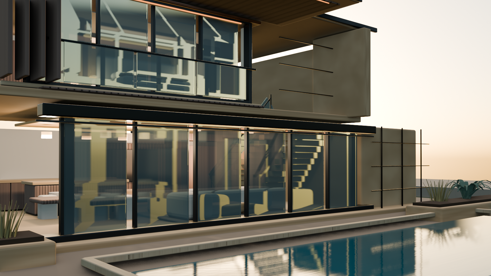

# Dubai Luxury Villa AI

An architectural visualization concept for presenting a contemporary villa, its interiors and its pool terrace through a live 3D tour.

**[Open the villa](https://safal207.github.io/Architectural-AI-Lab/)**

## The current concept

The viewer asset on `main` is **Pool Context v4**. It combines the earlier exterior, materials and interior-tour work with a repaired upper landing, an open master-suite threshold, layered bedroom furnishings and a planted desert setting beyond the pool's infinity edge.

The model contains a living area, kitchen island and dining area, staircase, upper landing, master bedroom and pool terrace. Its native Blender source, GLB export, render evidence and browser presentation form a reproducible visualization pipeline.

## Walk through the house

**Exterior → Entry → Living room → Kitchen + dining → Stair hall → Upper landing → Master bedroom → Pool terrace**

Select a room on the two-floor navigation plan or choose a tour stop. **Guided** mode presents authored camera views; **Explore** mode starts from the corresponding walk point and allows keyboard or touch movement along the route. On desktop, click the 3D view to look around, use WASD or arrow keys to move, and press Esc to release the pointer.

The pool's Guided camera is independent of its Explore anchor, allowing a wider presentation of the landscape without moving the walking route. The scene stays loaded when switching stops, modes, lighting or materials.

The plan is a navigation schematic. Route bounds are interaction aids, not a measured navmesh or construction-grade collision system.

## Current viewer asset

| Field | Value |
| --- | --- |
| Presentation version | Pool Context v4 |
| Stored identifier | `v0.4-pool-context-v4-feature-candidate` |
| File | [`web-viewer/app/public/villa.glb`](web-viewer/app/public/villa.glb) |
| Size | `8,613,156` bytes |
| SHA-256 | `4f3e2868b532d1e3ea50e83aeb9a696e3c1f6484b38b2067db4973b57e66d115` |
| Format | GLB 2.0 |

The stored identifier and original source receipts retain their feature-development names. They record the model's history; the asset itself is now included on `main`.

The model's material families and named room, tour, look-target and pool-presentation nodes are checked by [`tools/validate_viewer_asset.py`](tools/validate_viewer_asset.py). Browser lighting is owned by Three.js; duplicated Blender punctual lights are excluded from this asset. Day/evening/night and material controls are presentation choices, not pixel-identical reproductions of the Blender render above.

## Evidence and validation status

Evidence is tied to the asset and revision it checked:

- [Pool Context v4 source receipt](validation/v0.4-pool-context-v4-receipt.json) records the GLB and source render digests.
- [Original Pool Context v4 feature-promotion receipt](validation/v0.4-pool-context-v4-feature-promotion.json) records the initial feature-branch review. Its feature-only wording is historical, not the current deployment scope.
- [Interior2 visual review](validation/v0.4-interior2-critique.md), [Interior2 promotion](validation/v0.4-viewer-promotion.json) and the [earlier live QA report](validation/live-browser-qa.md) document the prior Interior2 baseline. Their passes do not certify later model or viewer changes.

At the reviewed `main` baseline `3dac25f`, build and deployment succeeded. [Live Browser QA run 35518268054](https://github.com/safal207/Architectural-AI-Lab/actions/runs/35518268054) reported horizontal overflow at a 320 px viewport. The mobile repair requires a fresh deployed QA pass before claiming full desktop/mobile success. [GitHub Actions](https://github.com/safal207/Architectural-AI-Lab/actions) contains subsequent run results.

## Presentation features

- Interactive room plan, tour route and room-linked metadata.
- Guided camera views, Explore movement, orbit and zoom.
- Furnished interiors, kitchen, staircase, master suite and landscaped pool context.
- Day, evening and night lighting; architectural material variants.
- A local metadata-grounded property assistant and investor summary.
- Desktop/mobile browser checks with screenshot evidence.

## Pilot scope

The site presents a **5-day visualization pilot** for one property concept or one priority zone: Blender geometry, web presentation, room-linked information and a QA receipt. Duration and deliverables depend on an agreed brief and usable source material; the offer is not a blanket delivery guarantee. Public GitHub intake should not include confidential client materials.

## Boundaries

This is an AI-assisted architectural visualization and virtual-tour portfolio prototype. It is not a measured architectural drawing set, specifications, BIM, engineering, construction or landscape documentation, code-compliance evidence, valuation, as-built documentation, or a representation of an existing property.

[Local setup and validation commands](web-viewer/app/README.md)
