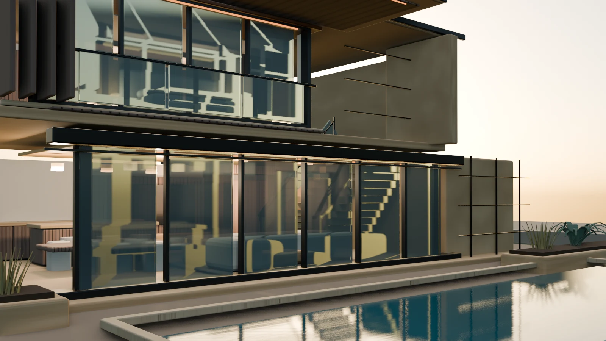

# Dubai Luxury Villa Web Viewer

An architectural portfolio combining kitchen and living-space studies, outdoor architecture, material palettes and an interactive villa. The current editorial direction is **Desert, distilled.**

[Public demo](https://safal207.github.io/Architectural-AI-Lab/) · [Editorial redesign — draft PR #9](https://github.com/safal207/Architectural-AI-Lab/pull/9)

The editorial redesign is a development preview for draft PR #9. The public demo remains on its existing deployment; this README describes the development version.



## Experience

- Architectural intent, project facts and an axonometric study exported from the current repaired model, with three explanations linked to 3D views.
- Sticky navigation through Concept, Spaces, 3D studio, Plan and Brief on desktop and mobile.
- A residence introduction and image stories for the kitchen/living area and pool terrace.
- An image gallery with keyboard navigation, Escape to close and focus return.
- Direct links from the image stories into the relevant 3D tour stops.
- A full-house pool-side overview with responsive framing, followed by Guided and Explore modes.
- Free Drone flight with drag-to-look, keyboard/touch movement, vertical controls and a Fly inside shortcut. Orbit overview returns to the exterior; Go inside starts the room tour.
- Day, evening and night presentation with reflected environment light and interior fixtures.
- Three material palettes beside the desktop model and compactly above it on mobile: Warm Limestone, Sandstone Warmth and Graphite Mineral.
- A two-floor navigation plan, eight tour viewpoints, room information and keyboard/touch controls.
- A kitchen shortcut and an explicit “Open … in 3D” return from the plan to the selected view.
- A local project-brief download with project type, location, approximate area, category-specific scope, priorities, notes, palette and atmosphere. Shared inputs persist between categories; area and scope are remembered separately. No form submission or account is required.
- A fallback image and explanation when the 3D view fails, leaving the gallery and brief tools usable.

The interface uses React, Three.js and Vite. A persistent scene avoids reloading the model when changing views. The browser owns runtime lighting, so web presentation differs from the native Blender renders.

[Architecture benchmark and development notes, in Russian](../validation/global-architecture-benchmark-2026-09-21.md) explain the reference projects and the earlier presentation changes, with verification for that revision. The subsequent [scene repair and drone report](../validation/scene-repairs-and-drone-2026-09-21.md) covers browser-time stair openings, pool surface/coping corrections and free flight. The canonical GLB is unchanged; concept diagrams and palette choices are not measured drawings or material specifications.

## Images and model

The gallery uses repository-render derivatives: Pool Context v4 for the exterior and the earlier Interior2 study for the kitchen/living image. These studies are not photographs or exact matches for the current browser scene. [Image source notes](app/public/editorial/README.md)

The unchanged canonical file is [`app/public/villa.glb`](app/public/villa.glb), described by [`villa.asset.json`](app/public/villa.asset.json):

| Field | Value |
| --- | --- |
| Presentation version | Pool Context v4 |
| Stored identifier | `v0.4-pool-context-v4-feature-candidate` |
| Format | GLB 2.0 |
| Size | `8,613,156` bytes |
| SHA-256 | `4f3e2868b532d1e3ea50e83aeb9a696e3c1f6484b38b2067db4973b57e66d115` |

The stored identifier retains the source model's historical name. It does not imply that the model is restricted to a feature branch, nor does it certify deployment of the redesigned interface.

## Local setup

Use Node.js 22 to match the build workflow. From this directory:

```sh
cd app
npm ci
npm run dev
```

For a production preview:

```sh
npm run build
npm run preview -- --host 127.0.0.1 --port 4173
```

## QA entry points

Run checks against the production preview. Browser scripts require Playwright and Chromium; the existing browser workflows use Playwright 1.55.0. Install those locally without changing the locked app dependencies:

```sh
npm install --no-save --package-lock=false playwright@1.55.0
npx playwright install chromium
```

In a separate terminal, from `app`, set `VILLA_URL` to `http://127.0.0.1:4173/`. Set `QA_OUTPUT` to a distinct evidence directory for each browser suite; `QA_SCREENSHOTS=0` disables optional screenshots in the full live-browser suite.

| Script | Checks |
| --- | --- |
| [`qa/live-browser.mjs`](app/qa/live-browser.mjs) | Model digest and delivery, desktop/mobile tour state, rooms, lighting, palettes, gallery controls, downloaded brief contents and narrow layout. |
| [`qa/mobile-hero-layout.mjs`](app/qa/mobile-hero-layout.mjs) | Loaded hero image, text/control containment, page sections and horizontal scrolling at 390 → 320 → 390 px. |
| [`qa/editorial-resilience.mjs`](app/qa/editorial-resilience.mjs) | Story-to-viewer focus and tour stops, clearing stale room details, invalidating a prepared brief after preference changes, and gallery/brief operation when WebGL is unavailable. |
| [`qa/first-person-ui.mjs`](app/qa/first-person-ui.mjs) | Guided/Explore controls and desktop/touch movement behavior. |
| [`qa/walkthrough-input.mjs`](app/qa/walkthrough-input.mjs) and [`qa/walkthrough-graph.mjs`](app/qa/walkthrough-graph.mjs) | Input lifecycle, authored navigation and route behavior. |
| [`qa/stair-presentation.mjs`](app/qa/stair-presentation.mjs) and [`qa/pool-presentation.mjs`](app/qa/pool-presentation.mjs) | Renderer-free checks against actual GLB geometry for stair openings, pool separation and coping alignment; preserved materials and route anchors. |
| [`qa/drone-controls.mjs`](app/qa/drone-controls.mjs) | Renderer-free checks of camera movement, input lifecycle, flight bounds and focus handling. |

Run each script with `node`, for example `node qa/editorial-resilience.mjs`. The resilience suite intentionally disables WebGL in a separate page and records the expected renderer errors; it checks that the portfolio remains usable rather than requiring an error-free simulated failure.

Asset provenance checks remain separate:

```sh
python -m unittest discover -s ../../tools -p 'test_validate_viewer_asset.py'
python ../../tools/validate_viewer_asset.py
```

The [earlier local repair report](../validation/portfolio-reconciliation-2026-09-21.md) documents the mobile repair before the editorial redesign. Historical Interior2 passes and that repair report are not acceptance evidence for this new revision. Final editorial results and post-deployment QA must be recorded separately.

## Concept limits

The plan is a navigation schematic with indicative areas. Walk bounds are interaction aids, not measured construction geometry or a complete collision simulation. Drone flight is free movement within scene bounds and can pass through surfaces. This portfolio and its downloaded brief are not BIM, specifications, engineering, construction documentation or representations of an existing property.

## Model-derived design study

The design diagram uses three static orthographic views of the production GLB after the same stair and pool repairs as the live viewer. Geometry is not repositioned. The illustration omits furniture, planting and distant context; glass is opaque for readability. Callouts project named mesh positions through the export camera, so they stay attached to actual features.

Regenerate from `app` with `node scripts/generate-design-study.mjs` (requires the existing Playwright QA tooling and installed Chromium). This writes three small WebP files and `data/design-study.json`. Run `node qa/design-study.mjs` to verify source hashes, exported image receipts and callout positions against the GLB. The source hashes normalize text line endings across Windows and Linux. Changing the GLB, runtime geometry repairs or exporter requires regenerating the study; CI rejects stale assets.

[Diagram correction and verification](../validation/model-derived-design-study-2026-09-21.md).
